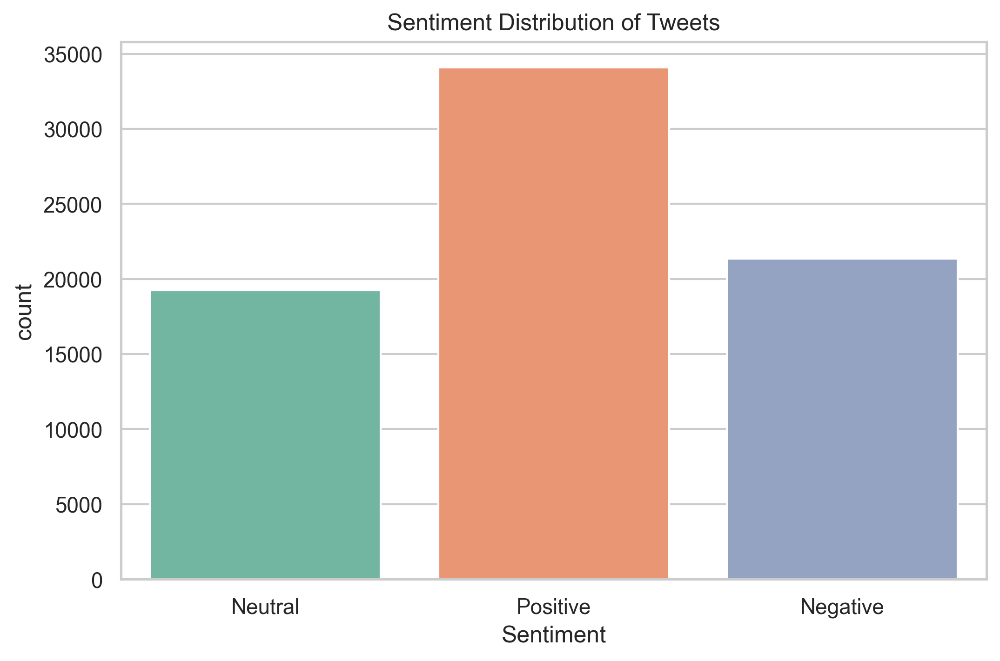

# Data Science Task 04: Twitter Sentiment Analysis

## 📝 Overview
In this project, I performed sentiment analysis on Twitter data to understand public opinion and emotional trends across different tweet contents. Using natural language processing techniques and sentiment polarity scoring, tweets were categorized into **Positive**, **Negative**, or **Neutral** sentiments. The resulting distribution is visualized using a bar chart.

The dataset used is publicly available from Kaggle:

- Dataset: [Twitter Entity Sentiment Analysis](https://www.kaggle.com/datasets/jp797498e/twitter-entity-sentiment-analysis)

---

## 🎯 Objective
The main objectives of this project are to:
- Load and explore the Twitter sentiment dataset.
- Process and clean tweet data for analysis.
- Apply sentiment polarity scoring using `TextBlob`.
- Classify tweets into sentiment categories.
- Visualize sentiment distribution using a bar plot.
- Save the generated plot for reporting or sharing.

---

## 🛠️ Steps to Execute

1. **Clone the Repository**:  
   Clone this repository to your local machine using:
   ```bash
   git clone https://github.com/Shreyabagal/PRODIGY_DS_04.git
   ```

2. **Install Dependencies**:  
   Install the required Python libraries using:
   ```bash
   pip install -r requirements.txt
   ```

3. **Run the Script**:  
   Execute the Python script to perform sentiment analysis and generate the visualization:
   ```bash
   python sentiment_analysis.py
   ```

4. **Output**:  
   The sentiment bar chart will be saved as:
   ```
   sentiment_distribution.png
   ```

---

## 📊 Visualizations

Below is a bar plot that shows the distribution of tweets by sentiment category:




---

## 🔍 Explanation of the Code

The Python script (`sentiment_analysis.py`) includes:
1. **Data Loading**: Reads tweet data from `twitter_training.csv`.
2. **Sentiment Scoring**: Uses `TextBlob` to calculate polarity scores.
3. **Sentiment Classification**: Converts polarity scores into categories — Positive, Negative, or Neutral.
4. **Visualization**: Uses `seaborn` and `matplotlib` to generate and save a sentiment distribution chart.

---

## 💻 Technologies Used
- Python
- Pandas
- TextBlob
- Seaborn
- Matplotlib

---

## 📁 File Structure
```
PRODIGY_DS_04/
├── twitter_training.csv          # Input dataset from Kaggle
├── sentiment_analysis.py         # Python script for sentiment analysis and visualization
├── sentiment_distribution.png    # Output bar chart
├── requirements.txt              # List of Python dependencies
├── README.md                     # Project documentation
```

---

